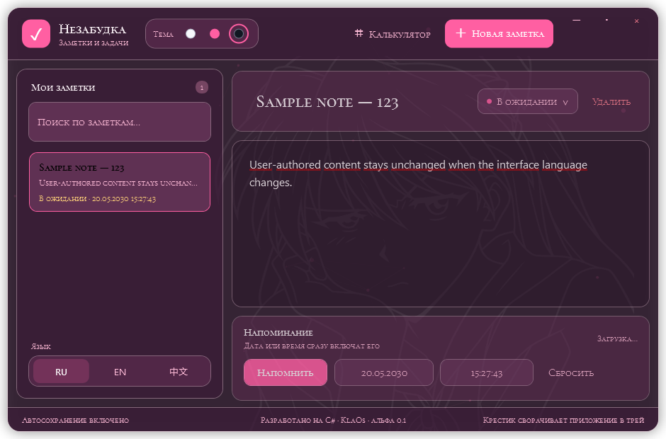

# Незабудка

«Незабудка» — локальный блокнот для Windows от KlaOs, в котором обычные заметки можно превращать в задачи с датой и временем.

Текущая разрабатываемая версия: alpha 0.2.

Проект KlaOs



## Готовая версия

Готовые сборки публикуются автором в разделе [Releases](https://github.com/SRZ539/Nezabudka/releases).
Скачайте ZIP для Windows x64, распакуйте его целиком и запустите `Nezabudka.exe`.
Сохраняйте вложенную папку `Assets/Fonts`: она содержит лицензии встроенных шрифтов.


## Возможности

- создание, редактирование и безопасное удаление заметок с быстрым восстановлением;
- закрепление важных заметок в верхней части списка;
- включаемое автосохранение и ручное сохранение через `Ctrl+S`;
- поиск по заголовку и содержимому;
- дата и время напоминания;
- системные уведомления и работа в трее;
- статусы «Активная», «В ожидании», «Выполнено» и «Закрыта»;
- собственный выбор часов, минут и секунд кнопками или колёсиком мыши;
- быстрое редактирование и удаление заметки через меню по правой кнопке мыши;
- плавные анимации кнопок, карточек, редактора и калькулятора;
- плавный cross-fade при переключении цветовой темы;
- полупрозрачный стеклянный интерфейс;
- ненавязчивый анимированный контурный фон, адаптирующийся к теме;
- фоновые точки, кольца, ромбы, искры и мини-незабудки, приостанавливающиеся вместе со скрытым окном;
- встроенный декоративный шрифт Cormorant SC с поддержкой кириллицы;
- собственная иконка окна, панели задач, системного трея и `.exe`;
- защита от запуска нескольких экземпляров приложения;
- белая, розовая и чёрная темы с запоминанием выбора;
- полная смена интерфейса между русским, английским и упрощённым китайским языками прямо во время работы;
- запоминание выбранного языка после закрытия приложения;
- встроенный калькулятор с вставкой результата в позицию курсора или вместо выделения;
- экспорт всех заметок в один файл `.nezabudka` и импорт с объединением или заменой;
- выбор собственной папки хранения данных;
- автоматические резервные копии при запуске, импорте и переносе папки;
- глобальные сочетания клавиш для быстрого открытия приложения и создания заметки;
- хранение данных только на компьютере пользователя.

Локальные горячие клавиши: `Ctrl+N` создаёт заметку, `Ctrl+F` открывает поиск, `Ctrl+K` показывает калькулятор, `Ctrl+S` сохраняет изменения. Глобальные сочетания: `Ctrl+Shift+Space` показывает или скрывает Незабудку, `Ctrl+Shift+N` сразу создаёт заметку.

Список заметок прокручивается колёсиком. Двойной щелчок по карточке сразу переводит курсор в текст, а правая кнопка мыши открывает действия «Редактировать» и «Удалить».

Как запустить из исходников

Понадобится Windows и [.NET 10 SDK](https://dotnet.microsoft.com/download/dotnet/10.0).

```powershell
dotnet run --project src/Nezabudka.App/Nezabudka.App.csproj
```

## Как собрать готовую программу

Команда создаст автономную 64-битную версию для Windows:

```powershell
dotnet publish src/Nezabudka.App/Nezabudka.App.csproj -c Release -r win-x64 --self-contained true -p:PublishSingleFile=true -p:IncludeNativeLibrariesForSelfExtract=true -p:DebugType=None -o artifacts/nezabudka-win-x64
```

Готовый файл `Nezabudka.exe` появится в папке `artifacts/nezabudka-win-x64`.
Для релиза упакуйте всю эту папку, включая `Assets/Fonts`, в ZIP.

Проверка тестов на Windows:

```powershell
dotnet test tests/Nezabudka.App.Tests/Nezabudka.App.Tests.csproj -c Release
```

## Где хранятся заметки

По умолчанию приложение сохраняет заметки в `%LOCALAPPDATA%\Nezabudka\notes.json`. Папку заметок можно изменить в меню данных; настройки при этом остаются в `%LOCALAPPDATA%\Nezabudka\settings.json`, чтобы приложение не потеряло выбранный путь. Резервные копии находятся во вложенной папке `Backups`. Эти файлы не попадают в репозиторий и остаются на компьютере пользователя.

Кнопка закрытия сворачивает приложение в системный трей, поэтому напоминания продолжают работать. После полного выхода напоминания снова проверяются при следующем запуске.

Шрифты Cormorant SC Regular и SemiBold включены в сборку по лицензии SIL Open Font License 1.1. Для китайского интерфейса вместе с приложением поставляется Noto Sans SC по той же лицензии. Тексты лицензий находятся в `src/Nezabudka.App/Assets/Fonts/OFL.txt` и `src/Nezabudka.App/Assets/Fonts/NotoSansSC-LICENSE.txt`.

Устройство проекта

- `Models` — формат сохраняемых данных;
- `Services` — чтение, безопасная запись, архивы, настройки и глобальные хоткеи;
- `ViewModels` — логика поиска, автосохранения и напоминаний;
- `MainWindow.xaml` — внешний вид приложения;
- `MainWindow.xaml.cs` — системный трей и действия окна.

В папке `tools/LocalizationSmoke` находится проверка интерфейса для всех трёх языков, включая всплывающие панели, календарь и наличие китайских глифов.

Идеи для следующих версий

- категории, теги и чек-листы;
- автозапуск вместе с Windows;
- установщик;
- полноценный просмотр корзины;
- отдельные плавающие заметки поверх других окон;
- синхронизация между устройствами.

## Авторы шрифтов

Спасибо [Noto Fonts](https://github.com/notofonts) за Noto Sans SC и
[Christian Thalmann / Catharsis Fonts](https://github.com/CatharsisFonts/Cormorant)
за Cormorant SC. Оба семейства используются по SIL Open Font License 1.1.
Подробные сведения и ссылки на тексты лицензий: [THIRD_PARTY_NOTICES.md](THIRD_PARTY_NOTICES.md).

Лицензия приложения

Лицензия исходного кода приложения пока не выбрана. Лицензии шрифтов указаны отдельно выше.
